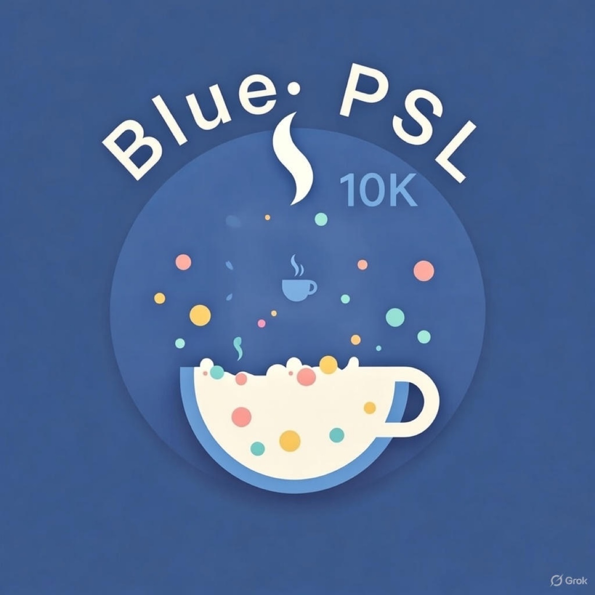
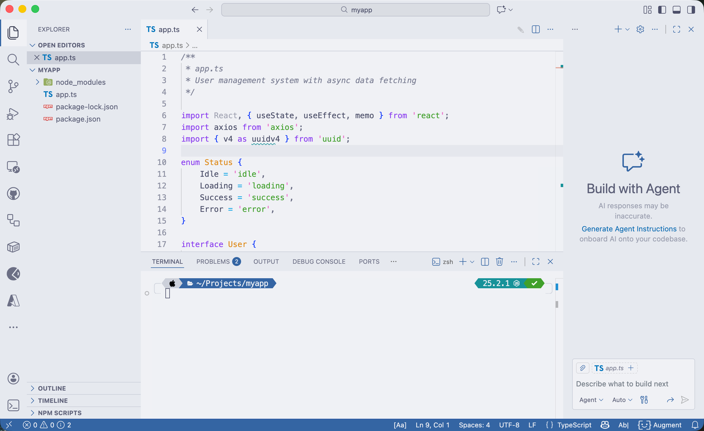

# Blue PSL 10K

<p align="center">
  
</p>

<p align="center">
  <a href="LICENSE"></a>
  <a href="https://github.com/catppuccin/catppuccin"></a>
  <a href="palette/palette.json"></a>
</p>

<p align="center"><strong>Eye-friendly pastels. Unapologetically posh. Blue PSL 10K brings the spice.</strong></p>

---

## Overview

**Blue PSL 10K** is a cohesive, multi-ecosystem color theme that combines:

- **Catppuccin Latte** – A soothing, eye-friendly pastel palette as the foundation
- **PowerLevel10K heritage** – Clean, information-dense prompt styling adapted for modern terminals
- **Oh-My-Posh integration** – Cross-shell prompt theming with consistent visuals
- **Unified path blue (`#3465a4`)** – A distinctive directory/path accent color that stays consistent across all your tools

The theme is available for:

| Ecosystem      | Status  |
| -------------- | ------- |
| Ghostty        | ✅ Ready |
| Oh-My-Posh     | ✅ Ready |
| macOS Terminal | ✅ Ready |
| VS Code        | ✅ Ready |

### Preview



---

## Installation

### Ghostty

1. Copy the theme file to Ghostty's themes directory:

   ```bash
   mkdir -p ~/.config/ghostty/themes
   cp ghostty/blue-psl-10k ~/.config/ghostty/themes/
   ```

2. Set the theme in your Ghostty config (`~/.config/ghostty/config`):

   ```ini
   theme = blue-psl-10k
   ```

3. Restart Ghostty or reload the configuration.

### Oh-My-Posh

1. Copy the theme file to your preferred location:

   ```bash
   mkdir -p ~/.config/oh-my-posh/themes
   cp posh/blue-psl-10k.omp.json ~/.config/oh-my-posh/themes/
   ```

2. Update your shell profile to use the theme:

   **Bash** (`~/.bashrc`):
   ```bash
   eval "$(oh-my-posh init bash --config ~/.config/oh-my-posh/themes/blue-psl-10k.omp.json)"
   ```

   **Zsh** (`~/.zshrc`):
   ```zsh
   eval "$(oh-my-posh init zsh --config ~/.config/oh-my-posh/themes/blue-psl-10k.omp.json)"
   ```

   **PowerShell** (`$PROFILE`):
   ```powershell
   oh-my-posh init pwsh --config ~/.config/oh-my-posh/themes/blue-psl-10k.omp.json | Invoke-Expression
   ```

3. Restart your shell or source the profile.

### macOS Terminal

1. Double-click `terminal/Blue PSL 10K.terminal` to import the profile, or:

   ```bash
   open "terminal/Blue PSL 10K.terminal"
   ```

2. Go to **Terminal → Settings → Profiles** and set "Blue PSL 10K" as the default.

### VS Code

**Option A: Install from VSIX (local)**

1. Package the extension:

   ```bash
   cd vscode
   npx @vscode/vsce package
   ```

2. Install the generated `.vsix` file:
   - Open VS Code
   - Press `Cmd+Shift+P` → "Extensions: Install from VSIX..."
   - Select `vscode/blue-psl-10k-0.1.0.vsix`

3. Select the theme:
   - Press `Cmd+K Cmd+T` → Choose "Blue PSL 10K"

**Option B: Development mode**

1. Open the `vscode/` folder in VS Code
2. Press `F5` to launch the Extension Development Host
3. Select the theme in the new window

---

## Color Palette

Blue PSL 10K is built on Catppuccin Latte with a custom accent:

| Role          | Hex       | Description                                        |
| ------------- | --------- | -------------------------------------------------- |
| Path Blue     | `#3465a4` | Directory/path accent (the "Blue" in Blue PSL 10K) |
| Background    | `#eff1f5` | Catppuccin Latte base                              |
| Foreground    | `#4c4f69` | Catppuccin Latte text                              |
| *More colors* | ...       | See `palette/palette.json`                         |

---

## Philosophy

The name **Blue PSL 10K** is a playful nod to:

- **PSL** – Pumpkin Spice Latte (Catppuccin's coffee-inspired naming) and *Posh Segment Latte* (Oh-My-Posh + prompt segments + Latte base)
- **10K** – The legendary PowerLevel10K prompt, whose styling inspired this theme's prompt layout
- **Blue** – The custom `#3465a4` path/directory color that unifies the look across terminals and editors

---

## License

[MIT](LICENSE) © 2025 Jeremy Combs

---

## Contributing

Contributions are welcome! Please see [CONTRIBUTING.md](CONTRIBUTING.md) for guidelines.

---

*Built with ☕ and 💙 by [@jmcombs](https://github.com/jmcombs)*
