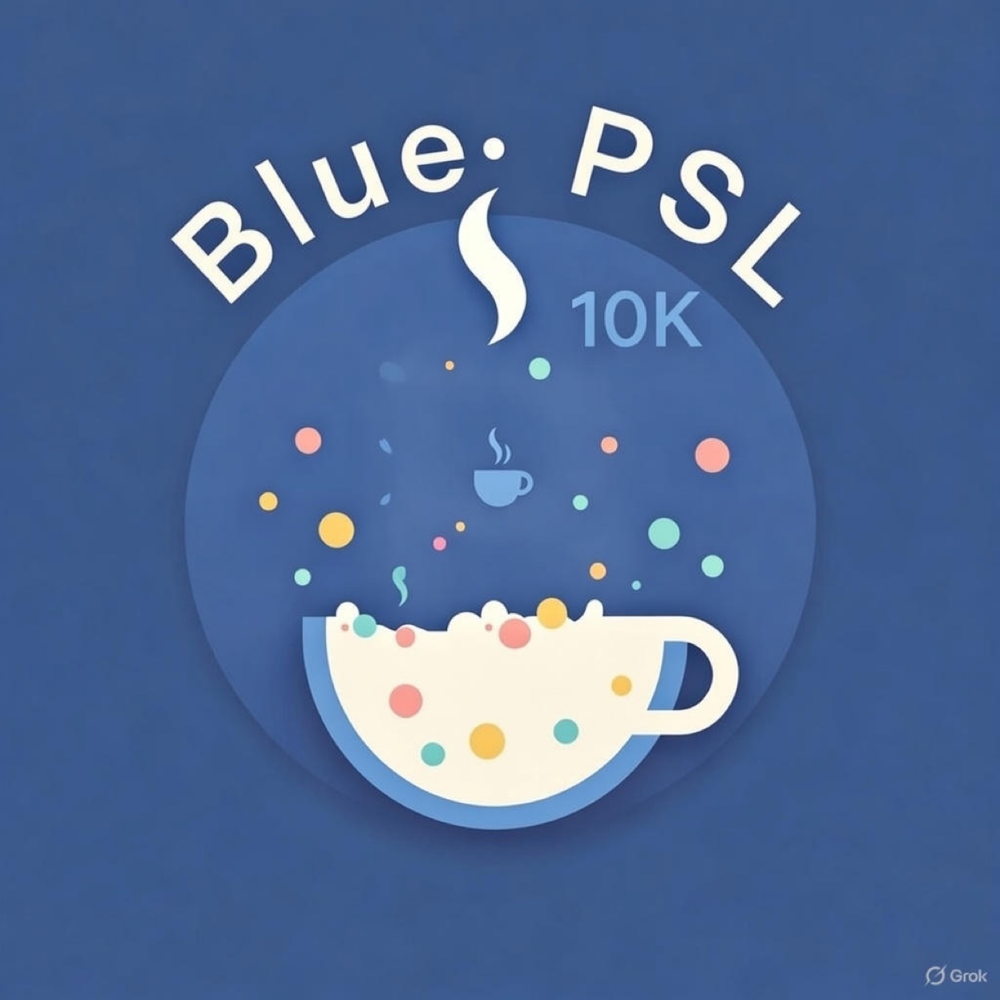
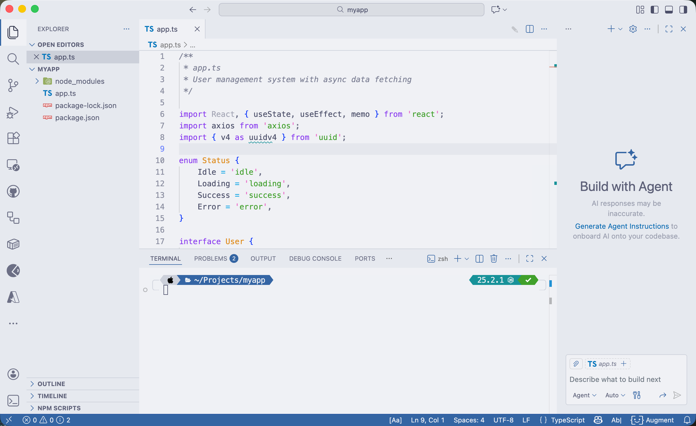

# Blue PSL 10K

<p align="center">
  
</p>

<p align="center">
  <a href="https://marketplace.visualstudio.com/items?itemName=jmcombs.blue-psl-10k"></a>
  <a href="LICENSE"></a>
  <a href="https://github.com/catppuccin/catppuccin"></a>
  <a href="palette/palette.json"></a>
</p>

<p align="center"><strong>Eye-friendly pastels. Unapologetically posh. Blue PSL 10K brings the spice.</strong></p>

---

## Overview

**Blue PSL 10K** is a cohesive, multi-ecosystem color theme that combines:

- **Catppuccin Latte** – A soothing, eye-friendly pastel palette as the foundation
- **PowerLevel10K heritage** – Clean, information-dense prompt styling adapted for modern terminals
- **Oh-My-Posh integration** – Cross-shell prompt theming with consistent visuals
- **Unified path blue (`#3465a4`)** – A distinctive directory/path accent color that stays consistent across all your tools

The theme is available for:

<!-- markdownlint-disable MD060 -->
| Ecosystem      | Status  |
| -------------- | ------- |
| Ghostty        | ✅ Ready |
| Oh-My-Posh     | ✅ Ready |
| macOS Terminal | ✅ Ready |
| VS Code        | ✅ Ready |
| pi coding agent| 🆕 Added |
<!-- markdownlint-enable MD060 -->

### Preview



---

## Installation

### Ghostty

1. Copy the theme file to Ghostty's themes directory:

```bash
mkdir -p ~/.config/ghostty/themes
cp ghostty/blue-psl-10k ~/.config/ghostty/themes/
```

1. Set the theme in your Ghostty config (`~/.config/ghostty/config`):

```ini
theme = blue-psl-10k
```

1. Restart Ghostty or reload the configuration.

### Oh-My-Posh

1. Copy the theme file to your preferred location:

```bash
mkdir -p ~/.config/oh-my-posh/themes
cp posh/blue-psl-10k.omp.json ~/.config/oh-my-posh/themes/
```

1. Update your shell profile to use the theme:

**Bash** (`~/.bashrc`):

```bash
eval "$(oh-my-posh init bash --config ~/.config/oh-my-posh/themes/blue-psl-10k.omp.json)"
```

**Zsh** (`~/.zshrc`):

```zsh
eval "$(oh-my-posh init zsh --config ~/.config/oh-my-posh/themes/blue-psl-10k.omp.json)"
```

**PowerShell** (`$PROFILE`):

```powershell
oh-my-posh init pwsh --config ~/.config/oh-my-posh/themes/blue-psl-10k.omp.json | Invoke-Expression
```

1. Restart your shell or source the profile.

### macOS Terminal

1. Double-click `terminal/Blue PSL 10K.terminal` to import the profile, or:

   ```bash
   open "terminal/Blue PSL 10K.terminal"
   ```

1. Go to **Terminal → Settings → Profiles** and set "Blue PSL 10K" as the default.

### VS Code

**Install from the Marketplace:**

1. Open **Extensions** in VS Code (`Cmd+Shift+X` / `Ctrl+Shift+X`)
1. Search for **"Blue PSL 10K"**
1. Click **Install**
1. Open the Command Palette (`Cmd+K Cmd+T` / `Ctrl+K Ctrl+T`)
1. Select **Blue PSL 10K**

Or install via command line:

```bash
code --install-extension jmcombs.blue-psl-10k
```

**Marketplace:** [Blue PSL 10K on VS Code Marketplace](https://marketplace.visualstudio.com/items?itemName=jmcombs.blue-psl-10k)

### pi coding agent

Blue PSL 10K is distributed for `pi` exclusively via Git — there is no npm package. Choose one of the two methods below.

#### Option 1 — Install as a Pi package (recommended)

```bash
# Global install (all projects)
pi install git:github.com/jmcombs/blue-psl-10k

# Or scoped to the current project (writes to .pi/settings.json)
pi install git:github.com/jmcombs/blue-psl-10k -l

# Pin to a specific release tag
pi install git:github.com/jmcombs/blue-psl-10k@v1.0.0
```

Re-run the same `pi install git:…` command to pull updates. To remove the theme, run `pi remove blue-psl-10k`.

#### Option 2 — Install from a dotfiles clone (symlink)

```bash
git clone https://github.com/jmcombs/blue-psl-10k.git ~/dotfiles/sources/blue-psl-10k

mkdir -p ~/.pi/agent/themes
ln -s ~/dotfiles/sources/blue-psl-10k/pi_theme/blue-psl-10k.json ~/.pi/agent/themes/blue-psl-10k.json

# Or scope to a single project instead
mkdir -p .pi/themes
ln -s ~/dotfiles/sources/blue-psl-10k/pi_theme/blue-psl-10k.json .pi/themes/blue-psl-10k.json
```

> **Tip:** `pi` hot-reloads themes when the file changes, so a `git pull` in `~/dotfiles/sources/blue-psl-10k` applies new theme revisions without restarting `pi`.

#### Activate the theme

Select the theme in `pi` via `/settings`, or set `"theme": "blue-psl-10k"` in `~/.pi/agent/settings.json` (or `.pi/settings.json` for project scope):

```json
{
  "theme": "blue-psl-10k"
}
```

---

## Color Palette

Blue PSL 10K is built on Catppuccin Latte with a custom accent:

| Role          | Hex       | Description                                        |
| ------------- | --------- | -------------------------------------------------- |
| Path Blue     | `#3465a4` | Directory/path accent (the "Blue" in Blue PSL 10K) |
| Background    | `#eff1f5` | Catppuccin Latte base                              |
| Foreground    | `#4c4f69` | Catppuccin Latte text                              |
| *More colors* | ...       | See `palette/palette.json`                         |

For detailed color usage patterns, design philosophy, and implementation guidelines, see the [**Style Guide**](palette/STYLE_GUIDE.md).

---

## Philosophy

The name **Blue PSL 10K** is a playful nod to:

- **PSL** – Pumpkin Spice Latte (Catppuccin's coffee-inspired naming) and *Posh Segment Latte* (Oh-My-Posh + prompt segments + Latte base)
- **10K** – The legendary PowerLevel10K prompt, whose styling inspired this theme's prompt layout
- **Blue** – The custom `#3465a4` path/directory color that unifies the look across terminals and editors

---

## License

[MIT](LICENSE) © 2025 Jeremy Combs

---

## Contributing

Contributions are welcome! Please see [CONTRIBUTING.md](CONTRIBUTING.md) for guidelines.

---

*Built with ☕ and 💙 by [@jmcombs](https://github.com/jmcombs)*
